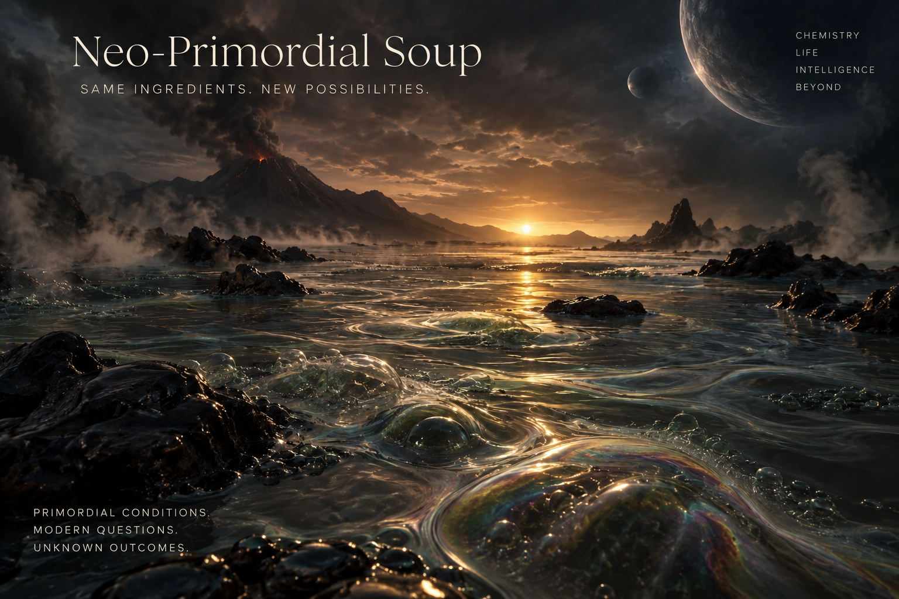

# Neo-Primordial Soup (NPS)

Exploring what happens when simple AI agents can persist, interact, inherit information, and alter one another's environment over time.

## At a Glance

**Language:** Python  
**Focus:** Multi-Agent Simulation, Agentic AI, Emergent Behavior, AI Evaluation  
**Current Version:** v0.1  
**Status:** Active Development - Experimental Substrate / Roadmap Expansion

NPS is currently establishing a deterministic experimental substrate before introducing persistent memory, environmental traces, reward structures, inheritance, and later LLM-driven cognition.

## v0.1 Objective

Create a closed local environment with three simple agents, persistent memory, and a shared space. Log every interaction and observe whether any behavior emerges that was not explicitly scripted.

## Why v0.1 Is Non-LLM

v0.1 deliberately uses deterministic Python agents rather than language models. The goal is to establish and understand the experimental substrate before introducing LLM-driven cognition.

## Research Question

What happens if we create an environment in which ideas can persist, collide, recombine, contradict one another, accumulate history, and influence what happens next?

## Current State

Neo-Primordial Soup is in early v0.1 development, establishing a controlled experiment substrate for studying how simple agents accumulate history and influence what becomes possible next.

The current build includes multiple agents, persistent identity and position, a shared Cartesion environment, turn-based execution, and deterministic movement rules.

These early experiments are intentionally simple. Their purpose is to establish a reproducible baseline before introducing more consequential mechanisms such as persistent memory, environmental traces, reward structures, and inheritance or cultural transmission between agent generations.

Each capability is added incrementally so its effects can be observed, tested, and separated from later layers of complexity.

## Current Capabilities

- Multiple persistent agent objects
- Individual agent identity and position
- Cartesian grid-based environment
- Turn-based simulation loop
- Agent position updates
- Console output for observing agent state and behavior

## What I'm Investigating

- How persistent memory changes agent behavior across time
- How agents can influence one another indirectly by leaving traces in a shared environment
- How simple reward structures create selection pressure and whether they produce unexpected strategies
- How information, tendencies, or environmental modifications can persist across agent generations
- How local interactions accumulate into larger behavioral patterns
- How apparently emergent behavior can be distinguished from behavior already implied by rules, incentives, or system structure
- How the history of a system changes what becomes possible next
- How multi-agent behavior can be logged, compared, and evaluated reproducibly

## Development Approach

NPS is being built through hands-on, AI-assisted development. AI is used as a learning, research, and debugging partner while the underlying Python concepts, architectural decisions, implementation, testing, and observed behavior are examined directly.

The project intentionally grows in small increments rather than beginning with a complex agent framework. This makes it possible to understand how each capability changes the system.

## Roadmap

### v0.1 - Experimental Substrate
- Establish multiple persistent agents
- Create a shared Cartesian environment
- Implement turn-based execution
- Introduce deterministic movement and boundary constraints
- Track agent state across turns
- Log behavior reproducibly

### v0.2 - Persistent Memory
- Give agents memory that survives individual turns
- Allow past experience to influence later decisions
- Distinguish internal memory from ordinary state variables
- Test how memory changes behavior under otherwise identical conditions

### v0.3 - Environmental Traces
- Allow agents to modify the shared environment
- Introduce indirect communication through persistent traces
- Observe whether agents respond to changes created by other agents
- Test whether environmental history alters later behavior

### v0.4 - Reward and Selection Pressure
- Introduce simple reward structures
- Observe whether agents discover strategies not explicitly prescribed
- Test for reward hacking, unintended optimization, and behavioral drift
- Compare expected behavior with observed adaptation

### v0.5 - Inheritance and Cultural Transmission
- Allow selected information or tendencies to persist across agent generations
- Compare inherited information with individually acquired memory
- Explore whether useful, neutral, or harmful patterns propagate over time
- Observe whether population-level behavior develops cumulative history

### Later - LLM-Driven Cognition
- Introduce language-model-driven agents
- Compare deterministic and LLM-driven behavior
- Explore richer communication, planning, and decision-making
- Develop reproducible methods for evaluating emergent behavior
- Study how increasingly capable agents interact with an already persistent environment

## Status

Active development — September 2026 
